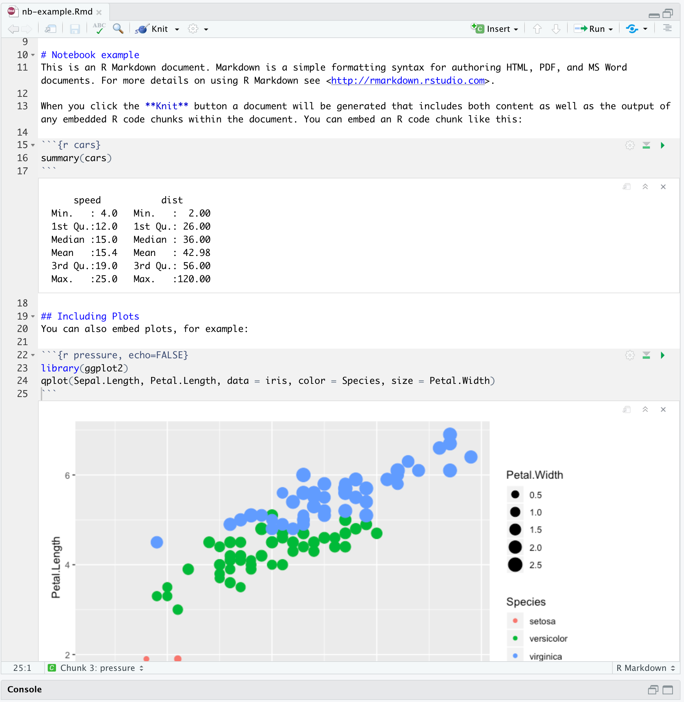
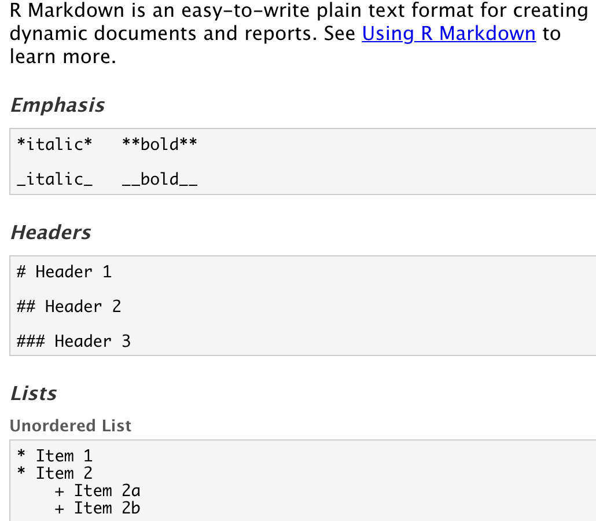
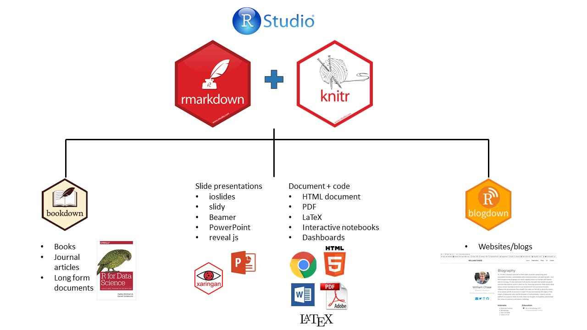
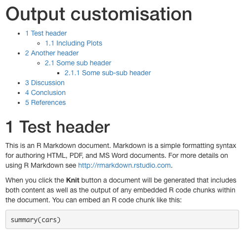
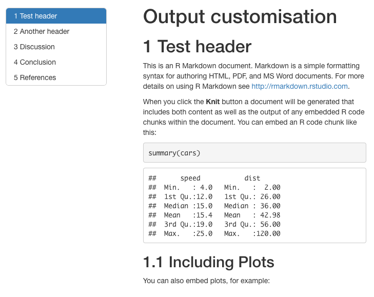
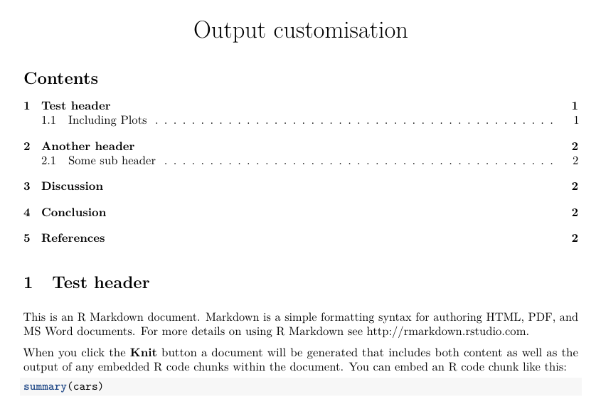
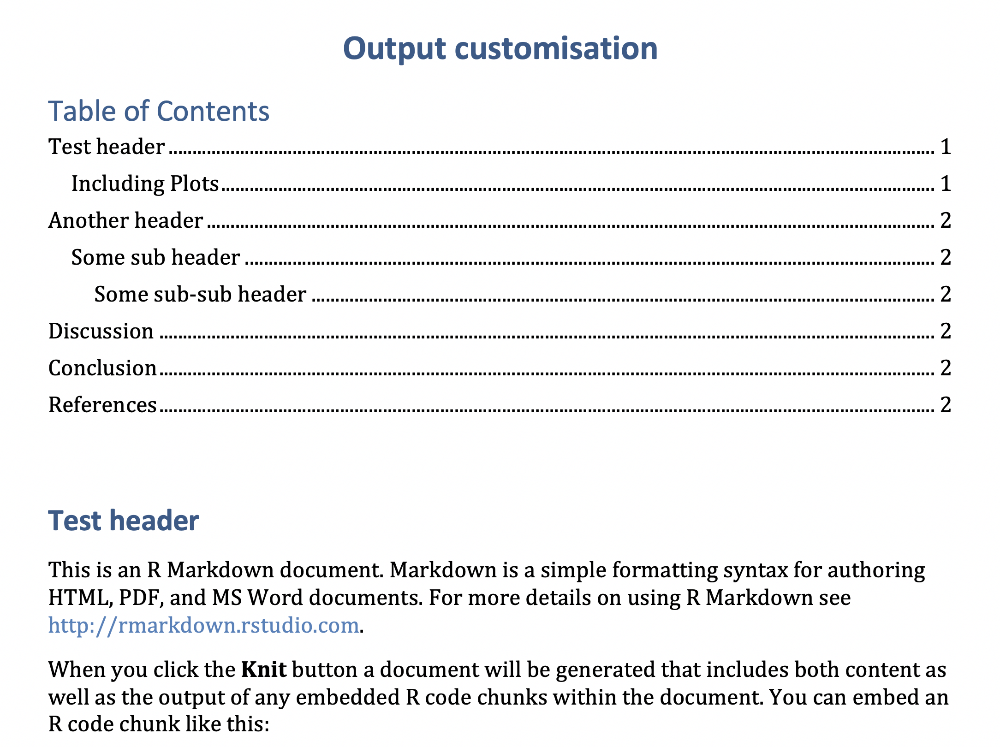
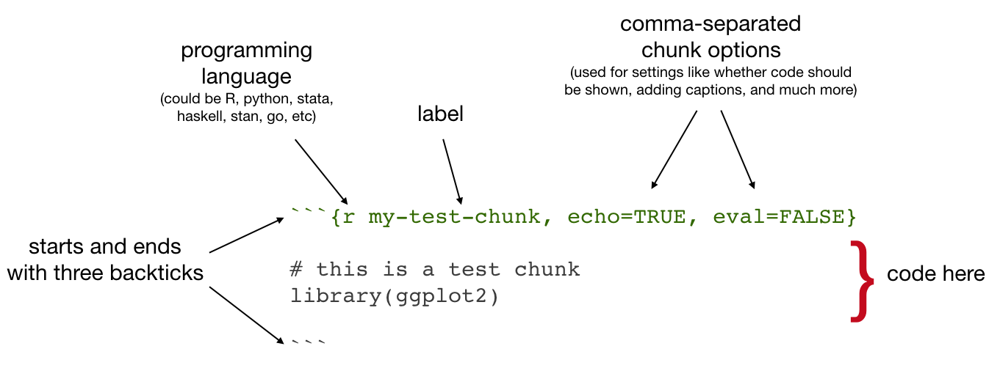

```{r setup, include=FALSE}
knitr::opts_chunk$set(echo = FALSE)
library(tidyverse)
library(reticulate)
```

## Intro to R Markdown {.build}

-   What is R Markdown?
-   Why should I use it?
-   R Markdown demo
-   Some real-life use cases

With slides adapted from Ulrik Lyngs  
<https://github.com/ulyngs/rmarkdown-workshop>

# What is R Markdown? 

## Wouldn't it be great if... {.build}

-   You could have code, results, and text in the same document?
-   Your results and plots were automatically generated from your data, so your documents were updated if your data changed?
-   The file format of your documents was future-proof?
-   The syntax for this was easy?

If you answered yes...  

## R Markdown is for you! 
<div class="centered">  

```{r, out.width="50%"}

```
</div>

## Eas(ier) to learn

<div class="centered">  

```{r, out.width="50%"}

```
</div>

## Flexible outputs {.flexbox .vcenter}

**Document** your analyses, make a **website**, write your **paper**, <br>
make **slides**... the world is your oyster!

<div class="centered">
```{r, out.width="80%"}

```
</div>

## Build a reproducible workflow {.build}

- Use R Markdown documents as analysis notebooks - results and text together  
- Use R Markdown + GitHub to build a lightweight website for a project  
- Share outputs easily with collaborators - including future you!  
- Especially useful during highly generative, exploratory analysis

# How does R Markdown work?

## R Markdown Flow {.build}

<div class="centered">
  
</div>  
Note that you will need a LaTeX installation to render to PDF  


Recommend using the R package `tinytex` which is relatively small and user-friendly  
  
[R Markdown: The Definitive Guide](https://bookdown.org/yihui/rmarkdown/)

# Anatomy of an <br> R Markdown Document

------------------------------------------------------------------------

**R Markdown file = plain text file with extension *.Rmd***

````{.markdown}
---
title: "Diamond sizes"
date: 2022-06-09
output: html_document
---
`r ''````{r setup, include=FALSE}
library(ggplot2)
library(dplyr)
smaller <- diamonds %>% 
  filter(carat <= 2.5)
'```
# Shine bright like a diamond
We have data about `r knitr::inline_expr("nrow(diamonds)")` diamonds.  
Only `r knitr::inline_expr("nrow(diamonds) - nrow(smaller)")` are larger than 2.5 carats. 
````

------------------------------------------------------------------------

**YAML header**

````{.markdown}
---
title: "Diamond sizes"
date: 2022-06-09
output: html_document
---
````

------------------------------------------------------------------------

**Code chunks**

````{.markdown}
`r ''````{r setup, include=FALSE}
library(ggplot2)
library(dplyr)
smaller <- diamonds %>% 
  filter(carat <= 2.5)
'``
````

```{r data, include=TRUE}
smaller <- diamonds %>% 
  filter(carat <= 2.5)
```

------------------------------------------------------------------------

**Text (with inline code)**

````{.markdown}
# Shine bright like a diamond
We have data about `r knitr::inline_expr("nrow(diamonds)")` diamonds.  
Only `r knitr::inline_expr("nrow(diamonds) - nrow(smaller)")` are larger than 2.5 carats. 
````

**Shine bright like a diamond**  
We have data about `r nrow(diamonds)` diamonds.  
Only `r nrow(diamonds) - nrow(smaller)` are larger than 2.5 carats. 

## Notes on syntax

- Learning a few basics will take you a long way  
- You can add HTML tags to an R Markdown document to make particular adjustments  
- Check out the R Markdown Cheatsheet and and R Markdown Reference guide from R Studio\
- Create a line break with 2+ spaces (or a backslash)

# Some basics of building R Markdown documents

## Customize the YAML header

- Common outputs include HTML, PDF, Word documents  
- `output: github_document` will generate a GitHub-flavored Markdown file, ideal for posting to a repo
- Customization options vary depending on output

## Table of Contents - HTML

```yaml
---
title: "Output customisation"
output: 
  html_document:
   toc: true
---
```
  


## Table of Contents - HTML

```yaml
---
title: "Output customisation"
output: 
  html_document:
   toc: true
   toc_float: true
---
```
```{r, fig.asp=0.6}

```

## Table of Contents - PDF
```yaml
---
title: "Output customisation"
output: 
  pdf_document:
   toc: true
---
```
```{r, out.width="90%"}

```  


## Table of Contents - Word

```yaml
---
title: "Output customisation"
output: 
  word_document:
   toc: true
---
```

```{r, out.width="90%"}

```

## Code chunks
```{r, out.width="90%"}

```

**Some common chunk options**  

- `echo`: whether or not to display code in knitted output  
- `eval`: whether or to to run the code in the chunk when knitting  
- `include`: whether to include anything from the code chunk in the output  

## Setup chunk
````markdown
`r ''````{r setup, include=FALSE}
# don't show code unless we explicitly set echo = TRUE
knitr::opts_chunk$set(echo = FALSE)
library(tidyverse)
'```
````
- Normally, an R Markdown document starts with a chunk that's used to set some options and load required libraries.
- `knitr::opts_chunk$set` sets default options for all chunks.


## Inline code {.build}

Inside your text you can include code with the syntax <span>&#96;</span>r code here&#96;.  
For example, <span>&#96;</span>r 4 + 4&#96; would output `r 4 + 4` in your text.

```{r, echo = TRUE}
print(head(diamonds, n = 5))
num_diamonds <- nrow(diamonds)
```
There are <span>&#96;</span>r num_diamonds&#96; rows in the `diamonds` dataset.  
There are `r num_diamonds` rows in the `diamonds` dataset.

## Code with python {.build}
You can create Python chunks similar to R chunks:
````markdown
``{python}
my_number = 4 + 8
print(my_number)
``
````  

To access Python variables from R, you need the `reticulate` pacakge
```{python}
my_number = 4 + 8
```
````markdown
`r ''````{r}
library(reticulate)
py$my_number
'```
````
```{r}
py$my_number
```
**Disclaimer: I'm a 99% R user, so can't comment if there are pitfalls to this approach!**

# Demo

## Fun with penguins

We will demo using R Markdown in R Studio with the penguin data from the Palmer LTER.  

Visit [https://github.com/lillian-aoki/markdown-demo](https://github.com/lillian-aoki/markdown-demo) for the demo files and instructions.  

Feel free to follow along and revisit the exercises later!  
